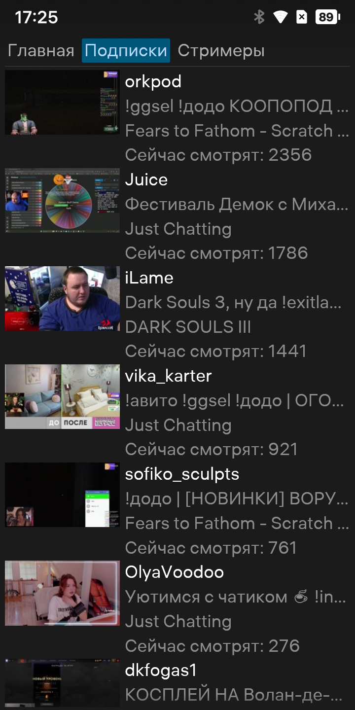
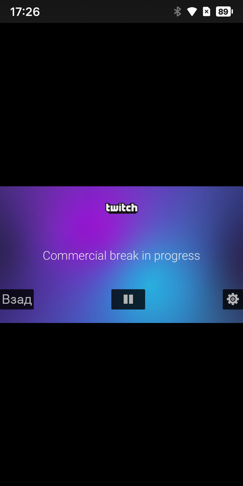
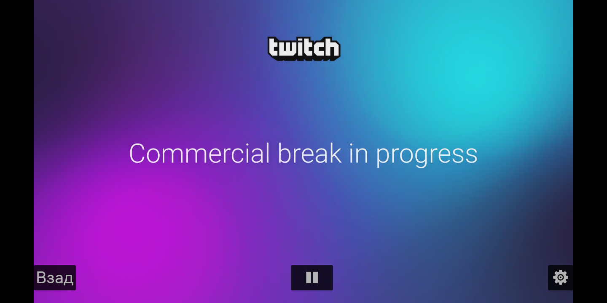

# TwAura

Неофициальный клиент Twitch для мобильной ОС Аврора (Aurora OS) и десктопного Linux с Wayland.

Приложение написано на Rust с использованием GUI-фреймворка [egui](https://github.com/emilk/egui) (через `eframe` на десктопе и `aurora_egui` на Авроре) и позволяет смотреть live-трансляции Twitch через HLS-потоки.

## Скриншоты

| Список подписок | Плеер (портретный режим) | Плеер (альбомный режим) |
|---|---|---|
|  |  |  |

## Возможности

- Просмотр live-стримов Twitch по HLS-плейлистам.
- Загрузка списка подписок через Twitch Helix API.
- Поиск каналов.
- Выбор качества видео из вариантов мастер-плейлиста.
- Воспроизведение аудио через PulseAudio (в том числе в sandbox Aurora OS).
- Поддержка портретной и альбомной ориентации.
- Авторизация через Twitch access token, который вводится в приложении и сохраняется в локальный конфиг.

## Технологический стек

- **Язык:** Rust (edition 2024).
- **GUI:** egui + eframe / aurora_egui (рендерер Glow, поддержка Wayland).
- **Асинхронность:** tokio.
- **HTTP:** reqwest с rustls.
- **Видео/аудио:** ffmpeg-next, m3u8-rs.
- **Аудиовывод:** libpulse-binding / libpulse-simple-binding.
- **Сериализация:** serde / serde_json.

## Авторизация

Для работы с подписками и поиском нужен Twitch access token. При первом открытии вкладки "Подписки" или "Стримеры" приложение покажет экран авторизации: можно открыть страницу получения токена или вставить его вручную. Токен сохраняется в:

```
~/.local/share/com.lmaxyz/TwAura/tw_aura.conf
```

> В исходном коде не зашит пользовательский OAuth-токен. Жёстко закодированы только публичный Twitch Client-ID и хэш persisted query для неофициального GQL API (см. `src/twitch/twitch_legacy.rs`), а также URL страницы авторизации (см. `src/twitch/ui/auth.rs`).

## Сборка

### Локальная сборка (Linux)

Требуются системные заголовки и библиотеки FFmpeg, PulseAudio, D-Bus и другие зависимости для линковки.

```bash
cargo build --release
```

### Кросс-компиляция

Для сборки под мобильные устройства используется `cross` и Docker:

```bash
# aarch64
cross build --release --target aarch64-unknown-linux-gnu

# armv7
cross build --release --target armv7-unknown-linux-gnueabihf
```

Кастомные образы и список необходимых dev-пакетов описаны в `Dockerfile`, `arm.Dockerfile` и `Cross.toml`.

### Сборка RPM для Aurora OS

Требуется установленный Aurora Platform SDK (`PSDK_DIR`).

```bash
# aarch64
./aarch64_build.sh

# armv7
./arm_build.sh
```

Скрипты собирают бинарник, формируют RPM внутри chroot SDK, подписывают его внешним сертификатом и проверяют через `rpm-validator`.

## Установка

Собранный RPM можно установить стандартным образом на устройство под Aurora OS. При установке:

- бинарник помещается в `/usr/bin/com.lmaxyz.TwAura`;
- регистрируется `.desktop`-файл приложения;
- иконки копируются в `/usr/share/icons/hicolor/`.

## Разработка

```bash
# Отладочная сборка
cargo build

# Запуск
cargo run
```

## Лицензия

Apache-2.0
